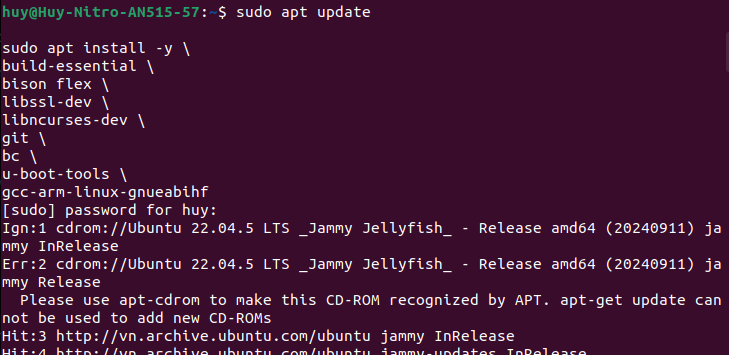
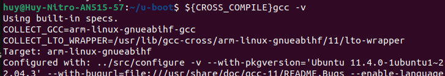
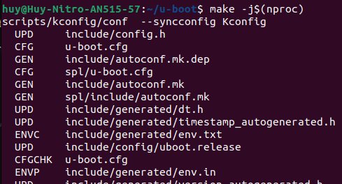

## CÀI MÔI TRƯỜNG CHUẨN:
sudo apt update

sudo apt install -y \
build-essential \
bison flex \
libssl-dev \
libncurses-dev \
git \
bc \
u-boot-tools \
gcc-arm-linux-gnueabihf

## SET TOOLCHAIN (QUAN TRỌNG NHẤT):
export ARCH=arm
export CROSS_COMPILE=arm-linux-gnueabihf-

# Test:
${CROSS_COMPILE}gcc -v

## BUILD bootloader U-BOOT
git clone https://github.com/u-boot/u-boot --depth=1 -b v2022.04
cd u-boot

make distclean
make am335x_evm_defconfig
make -j$(nproc)

# Check lỗi nhanh
which arm-linux-gnueabihf-gcc
echo $CROSS_COMPILE

# Output:
MLO (SPL/first-stage bootloader)
u-boot.img (second-stage bootloader)

